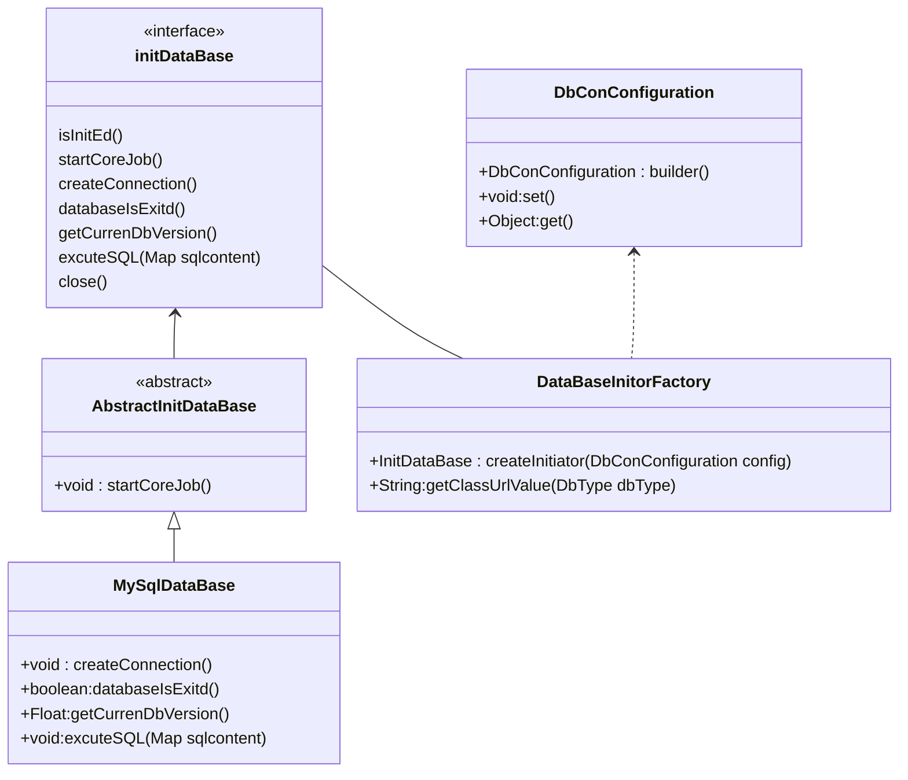

# Conscript 数据库初始化工具

> Conscript 取自 “红警”苏军阵营最基本的作战单位—动员兵，就像步兵是作战中最基础的战力一样， 初始数据库也是大多数程序要做的第一件事，也是最基础的事

## 1.相关代码结构

```shell

+---conscript                                     #基础功能包 
|   +---entity						              #配置实体类
|   +---enumerate						       #数据库类型枚举	 
|   +---mysql                                 #mysql数据库实现
----initDataBase							  #数据库初始化接口
----DataBaseInitorFactory					  #数据库初始器工厂
----AbstractInitDataBase				      #数据库初始器基类
```

## 2.实现设计

| 类                    | 介绍                     |
| --------------------- | ------------------------ |
| initDataBase          | 初始化接口               |
| AbstractInitDataBase  | 初始化基类，定义核心逻辑 |
| MySqlDataBase         | Mysql实现，具体执行方式  |
| DataBaseInitorFactory | 工厂类                   |




> **扩展其他类型数据库：可以继承AbstractInitDataBase类，实现对应的几个数据库操作方法，在DbType中追加对应扩展的类**

##3.使用方式

### 1.引入Conscript

1.1.使用jar引入

```xml
<dependency>
    <groupId>com.gcc</groupId>
    <artifactId>Conscript</artifactId>
    <version>1.0</version>
</dependency>
```

1.2.引入源码

​	将conscript.jar导入项目中即可

### 2.建立SQL文件存放目录

> 以标准maven项目为例

​	1.在resource目录下新建sql目录，里面存放需要升级的sql文件

​	2.在resource目录下新建XX.json文件作为配置文件，XX.json文件样例如下：

mysql-dbconfig.json

```json
 [
   {
      "version": "1.0",
      "sqlfile": "a.sql",
      "desc": "基础数据库结构"
   },
    {
       "version": "1.1",
       "sqlfile": "ddd.sql",
       "desc": "第一版升级数据库"
    }
 ]
```

| 字段    | 含义                            |
| ------- | ------------------------------- |
| version | 数据库的版本                    |
| sqlfile | 数据库升级的sql文件，叠加式追加 |
| desc    | 维护使用的描述信息              |

### 3.构建DbConConfiguration对象

DbConConfiguration对象所需参数如下，均需必填

| 参数            | 意义                           |
| --------------- | ------------------------------ |
| host            | 数据库服务ip地址               |
| port            | 数据库服务端口                 |
| dbname          | 数据库名称（需要初始化的库名） |
| user            | 数据库连接账号                 |
| password        | 数据库连接密码                 |
| dbconfigfileurl | 数据库升级配置文件             |
| driverclassname | 数据库连接驱动名称             |
| dbtype          | 数据库类型                     |

### 4.使用初始器工厂创建数据库初始器

​	将DbConConfiguration对象作为DataBaseInitorFactory工厂方法的参数，生产数据库初始器对象，进行数据库初始化：

```java

public static void main(String args[]){
    DbConConfiguration conConfiguration = new DbConConfiguration.Builder()
                .setHost(cfgBean.getHost())
                .setDbport(cfgBean.getDbport())
                .setDbname(cfgBean.getDbname())
                .setConfigFileUrl("mysql-dbconfig.json")
             .setDriverclassname(cfgBean.getDriverclassname())
                .setDbtype(cfgBean.getDbtype().getDbtype())
                .setUser(cfgBean.getUser())
                .setPassword(cfgBean.getPassword())
                .build();
        InitDataBase initdb = DataBaseInitorFactory.createInitiator(conConfiguration);
        try {
            initdb.startCoreJob();
        }catch (SQLException e){
            log.error("数据库错误"+e.getMessage());
        }    

}
```
